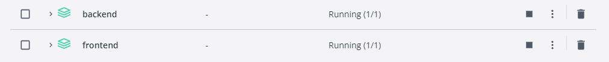
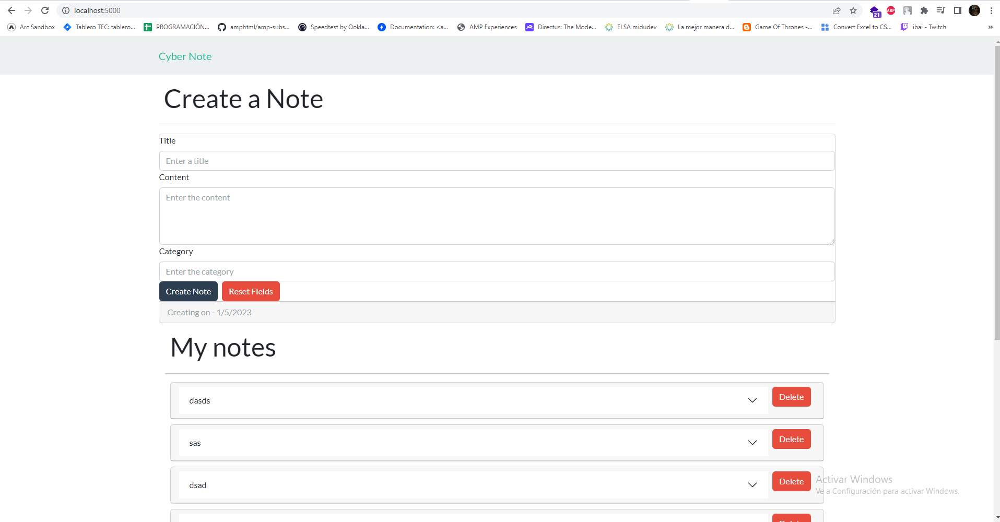

# Cyber Note

## To start setting up the project

Esta es una aplicación MERN de pila completa que permite a los usuarios crear, leer y eliminar notas. los usuarios pueden crear notas con un título y un cuerpo. También pueden eliminar sus notas. tiene un diseño responsive que funciona bien tanto en dispositivos de escritorio como móviles.

#### Live URL - http://localhost:5000

### Step 1: Clone the repo or download

```bash
git clone https://github.com/sohelrana1304/cyber-note.git
```

### Step 2: cd into the cloned repo and run:

- Command to instal dependencies and Start the Backend Server:

```bash
cd backend
docker compose build
docker compose up
```

- Command to instal dependencies and Start the Client Side:

```bash
cd frontend
docker compose build
docker compose up
```

### Step 3: Go to backend folder and put your credentials in the `.env` file or create a `.env` file in backend directory and then put your credentials.

#### To go to backend folder:

```bash
cd backend
```

#### Credentials:

```bash
PORT=4000
MONGODB_URI=YOUR MONGODB URI
JWT_SECRET=YOUR SECRET KEY
```

### APP RUNNING IN DOCKER:



### APP RUNNING:


